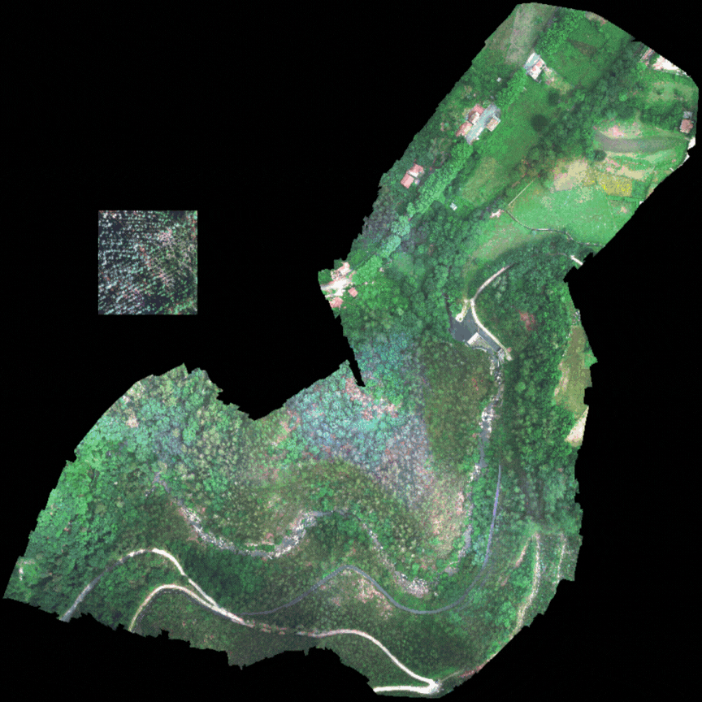

# 📚 Traballo de Fin de Grao de Hugo Carreira Rial
## Técnica de clasificación de imaxes de observación terrestre baseada nun transformador híbrido

Durante os últimos anos, a aprendizaxe automática e as redes neuronais de deep
learning están a ser o punto neurálxico do interese de moitos investigadores,
empresas e administracións públicas. Concretamente, na área de remote sensing, o
coñecemento está a focalizarse nas imaxes multiespectrais e na creación de xemelgos
dixitais para a análise de vertidos, superficies arbóreas ou o mantemento de grandes
extensións de pradarías agrícolas.

Por este motivo, considerouse que realizar un traballo nunha materia de actualidade
podería resultar interesante para coñecer o estado da arte, así como aportar
un gran de area ao campo da clasificación de imaxes. Para iso, empregáronse diversos
transformadores, co fin de adaptalos a un conxunto de imaxes multiespectrais
obtidas das cuncas dos ríos galegos. Un dos principais retos consistiu na escolla de
métodos precisos e eficientes, que á súa vez puidesen ser trasladados a situacións
en tempo real, moi aplicables, como mencionamos, aos xemelgos dixitais que tamén
desde Galicia se están a potenciar.

Con isto, realizouse unha experimentación que permitiu obter unhas métricas
de precisión e custo moi interesantes. Destacouse principalmente que os modelos
transformadores híbridos, como FastViT ou CoAtNet, son potencialmente útiles para
situacións que requiren a maior precisión e o menor tempo. Tamén se concluíu
que existe unha forte compoñente global nas imaxes de teledetección das cuncas dos
ríos, polo que é necesario captar ditas características nestas primeiras etapas para
realizar a inferencia de clase.

**Palabras clave / keywords**: clasificación, multiespectral, transformadores híbridos,
transformadores, xemelgos dixitais, tempo real

## Traballo de clasificación realizado en imaxes MSI

## Instalación do software 💻 

Para a execución do seguinte código, é necesario ter instalado previamente o software que se indica a continuación: 

- Anaconda en caso de que o usuario non teña permisos de administrador: 

    `wget https :// repo. anaconda .com/ miniconda /Miniconda3 -latest -Linux-x86_64 .sh`

    `bash Miniconda3-latest-*.sh`

    `source ~/.bashrc   # o ~/.zshrc en entornos Mac`

    `conda --version`

- Creación do entorno conda, no cal estarán instaladas as dependencias:

    `conda create -n guild-env python=3.10 -y `

    `conda activate guild-env # actuvación do entorno guild-env, permanecendo activado na terminal `

- Instalación das dependencias

    `conda install pytorch==2.5.1 torchvision==0.20.1 torchaudio==2.5.1 pytorch-cuda=12.4 -c pytorch -c nvidia`

    `pip install numpy==2.0.2 scikit-learn==1.6.0 timm==1.0.15 einops==0.8.1`

- No caso de non ter instalado CUDA, deberemos execitar o seguinte comando: 

    `conda install -c nvidia cudatoolkit=12.4`

- Instalación de Guild AI

    `pip install guildai # instalación do software`

    `guild check # verifica que a instalación se completou`

- Configuración do entorno e descarga do proxecto ✅

    `mkdir probasTFGHugoCarreira # creación dun directorio de exemplo`

    `cd probasTFGHugoCarreira`

    `git clone https://github.com/hugocarreirarial06/TFG_HugoCarreiraRial.git`

    `ls -l # verificar que se descargaron os arquivos de xeito correcto`

    `conda activate guild-env # activación de miniconda na terminal`

    `conda deactivate guild-env`

## Autor

- [Hugo Carreira Rial](https://www.github.com/hugocarreirarial06)

